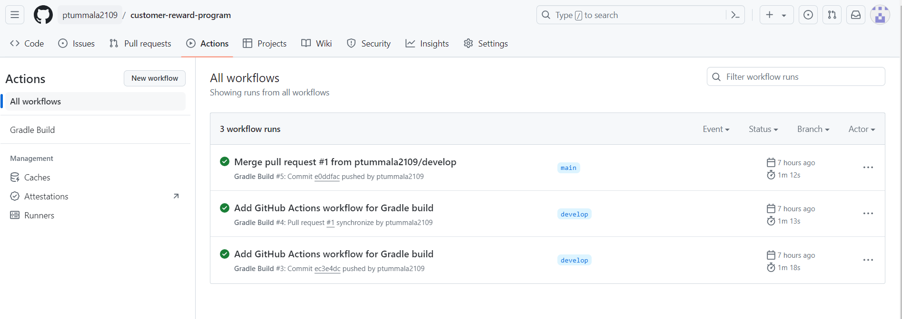

# Customer Rewards Program Application

## Description
A retailer exposes an API that provides the following functionalities:

1. Retrieve Customer Records: Allows retrieval of customer records.

2.  Calculate Reward Points: Calculates reward points for customers.

Initialization Process

When the application starts, it loads some sample records for testing purposes.

## How to Run
To run the application, execute the following steps:

1. Ensure Gradle is Pre-Installed
   - Gradle needs to be pre-installed on your machine.
2. Clone the repository (https://github.com/ptummala2109/customer-reward-program.git)
3. Navigate to the project directory
4. Build the project: `./gradlew clean build`
5. Run the application:  `./gradlew bootRun`

**Note:** Gradle should be able to auto-detect the Spring Boot application file ServiceImplApplication and start it on port 8080.

**Alternative: Using IntelliJ IDEA**
- If not using Gradle, open the application in IntelliJ IDEA.
- Navigate to the RewardTransactionApplication file under the com.retailer.services project.
- Right-click on RewardTransactionApplication and select Run.

## API Documentation

### Create a Transaction
- **URL:** `http://localhost:8080/retailer/api/transactions/v1`
- **Method:** `POST`
- **Request Body:**
```json
{
    "trans_id": 1,
    "customer_id": 99999,
    "amount": 120.0,
    "transaction_date": "2024-06-27"
}
```

- **Response Body:**
```json
{
    "trans_id": 1,
    "customer_id": 99999,
    "amount": 120.0,
    "transaction_date": "2024-06-27"
}
```

### Get All Transactions
- **URL:** `http://localhost:8080/retailer/api/transactions/v1`
- **Method:** GET
- **Response Body:** Example
```json
[
   {
      "trans_id": 1,
      "customer_id": 99999,
      "amount": 120.0,
      "transaction_date": "2024-06-24"
   },
   {
      "trans_id": 2,
      "customer_id": 98765,
      "amount": 120.0,
      "transaction_date": "2024-02-27"
   }
]
```

### Get Transactions by CustomerId
- **URL:** `http://localhost:8080/retailer/api/transactions/v1/customer/99999`
- **Method:** GET
- **Path Variable:** customer_id
- **Response Body:** 
```json lines
[
    {
        "trans_id": 1,
        "customer_id": 99999,
        "amount": 120.0,
        "transaction_date": "2024-06-27"
    }
]
```

### Get Reward points for a Customer
- **URL:** `http://localhost:8080/retailer/api/transactions/v1/rewards/99999`
- **Method:** GET
- **Path Variable:** customer_id
- **Response Body:**
```json lines
{
    "2024-04": 0,
    "2024-06": 90,
    "2024-05": 0
}
```

### Get Reward points for a Customer between Transaction Date
- **URL:** `http://localhost:8080/retailer/api/transactions/v1/rewards/date/12345?startDate=2024-04-27&endDate=2024-06-27`
- **Path Variable:** customer_id
- **Request Parameters:** `startDate<LocalDate>` and `endDate<LocalDate>`
- **Method:** GET
- **Response Body:**
```json lines
{
    "JUNE": 0,
    "MAY": 52,
    "APRIL": 50
}
```

### Error Handling
Returns appropriate HTTP status codes (200, 400, 422, 500) with human-readable messages.

## H2 Config
1. data.sql and schema.sql are created for customer(s) and sample transactions are included.
2. http://localhost:8080/retailer/h2-console (To view the h2 db console)
3. JDBC_URL: jdbc:h2:mem:my_retailer_db, username: sa, password: password


## Build (Github Action)

1. Every Push and Pull to github will trigger github actions build which will do the gradle clean build.
2. Also a cron job is included for the build to auto trigger everyday.
3. https://github.com/ptummala2109/customer-reward-program/actions



## Code coverage

